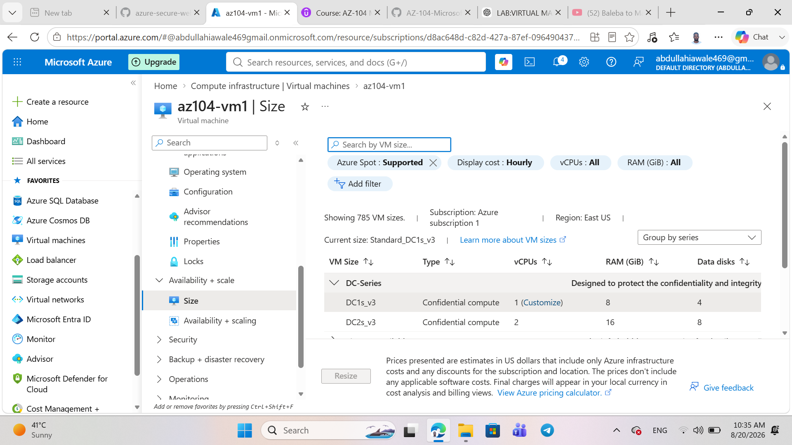
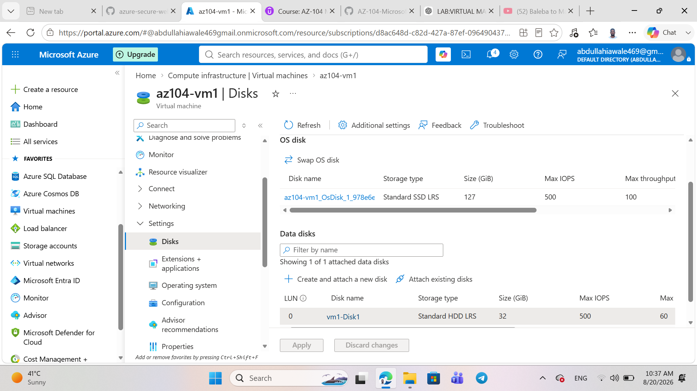
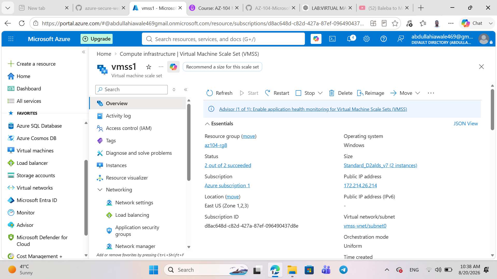
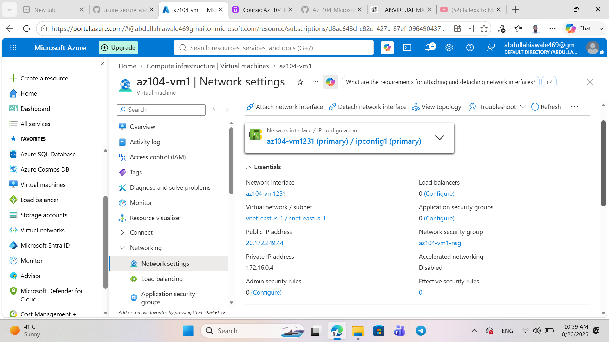
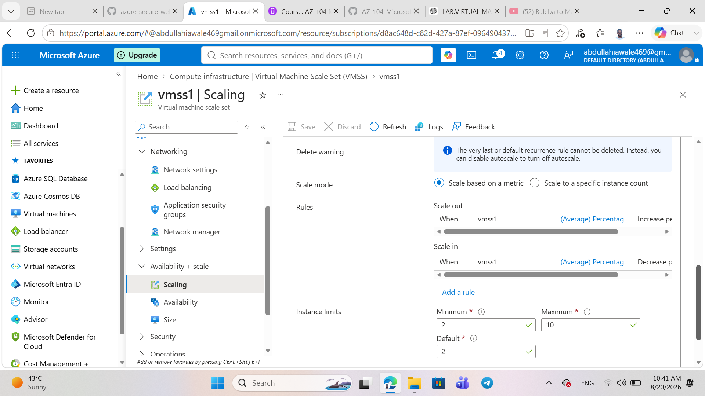

# Lab 08: Manage Virtual Machines

## Overview

This lab focused on deploying, configuring, scaling, and managing Azure Virtual Machines and Virtual Machine Scale Sets.

## Tasks Completed

### Task 1: Deploy Zone-Resilient Azure Virtual Machines

- Created two Azure Virtual Machines.
- Deployed the VMs across Availability Zone 1 and Zone 2.
- Used Windows Server 2025 Datacenter.
- Used Standard D2s_v3 VM size.
- Configured Premium SSD OS disks.
- Disabled public inbound ports.
- Used Availability Zones to improve VM availability.

### Task 2: Manage Compute and Storage Scaling

- Deallocated `az104-vm1`.
- Resized the VM from `Standard D2s_v3` to `D2ds_v4`.
- Created a 32 GiB data disk.
- Initially configured the disk as Standard HDD.
- Detached the disk.
- Changed the disk to Standard SSD.
- Reattached the disk to the VM.

### Task 3: Create and Configure Virtual Machine Scale Sets

- Created a Virtual Machine Scale Set named `vmss1`.
- Configured Availability Zones 1, 2, and 3.
- Created a custom virtual network.
- Created subnet `subnet0`.
- Created Network Security Group `vmss1-nsg`.
- Created an HTTP inbound security rule.
- Created Azure Load Balancer `vmss-lb`.
- Configured public networking for the scale set.

### Task 4: Configure Autoscaling

Configured custom autoscaling for `vmss1`.

#### Scale Out

- Metric: Percentage CPU
- Condition: Greater than 70%
- Duration: 10 minutes
- Statistic: Average
- Action: Increase instance count by 50%
- Cooldown: 5 minutes

#### Scale In

- Metric: Percentage CPU
- Condition: Less than 30%
- Duration: 10 minutes
- Statistic: Average
- Action: Decrease instance count by 50%

#### Instance Limits

- Minimum: 2
- Default: 2
- Maximum: 10

## Architecture

The lab demonstrated the following Azure architecture:

Azure Virtual Machines  
→ Availability Zones  
→ Managed Disks  
→ Virtual Network  
→ Network Security Group  
→ Load Balancer  
→ Virtual Machine Scale Sets  
→ Autoscaling

## Skills Demonstrated

- Azure Virtual Machines
- Availability Zones
- VM sizing and vertical scaling
- Azure Managed Disks
- Virtual Machine Scale Sets
- Azure Load Balancer
- Network Security Groups
- Azure Virtual Networking
- Autoscaling
- Azure Portal administration

## Task 1: Deploy Zone-Resilient Azure Virtual Machines

## Task 2: Manage Compute and Storage Scaling

## Task 3: Create and Configure Virtual Machine Scale Sets

## Task 4: Configure Autoscaling

## Evidence

Screenshots from the completed lab are available in the `screenshots` directory.
